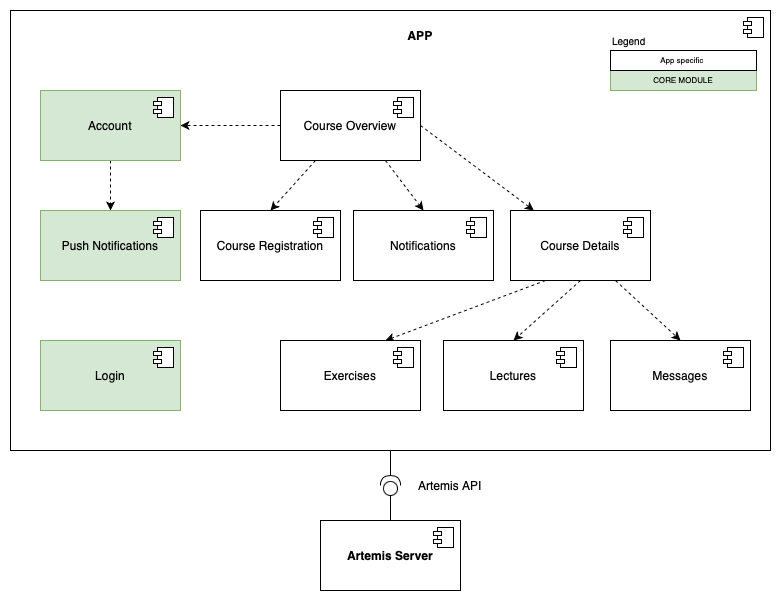

# Artemis iOS

The Artemis iOS application aims to replace the current Artemis web platform for iPhone users, providing a more user-friendly interface. The application includes features such as course details, the respective lecture and exercise overview, exercise participation, and instant messaging. 

## Architecture

This section examines the subsystem decomposition of the `App`, as depicted in the referenced figure (`app-subsystem`).
The primary focus is identifying all `App` subsystems and their usage of the [Core Module](https://github.com/ls1intum/artemis-ios-core-modules/blob/main/README.md).
Subsystems part of the `Core Module` are highlighted in green, and arrows illustrate relationships between subsystems.
For the sake of simplicity, we do not show all `Core Module` subsystems.
Therefore the *User Session Store*, *Common Utility*, *Artemis Profile Info*, *API Client*, *Shared Models*, *Design Library*, *Shared Services*, and *Artemis Markdown* subsystems are not shown in the figure.
More information on the iOS core module (`ios-core-module`) can be found [here](https://github.com/ls1intum/artemis-ios-core-modules/blob/main/README.md).

The *Course Overview* subsystem serves as the app's home screen and thus encompasses all other subsystems.
Consequently, it has a dependency on the *Account*, *Course Registration*, *Notifications*, and *Course View* subsystems.

The *Course View* includes all details about a specific course and therefore uses the *Exercises*, *Lectures*, and *Messages* subsystems. The *Exercises* subsystem is responsible for displaying all exercises as well as showing detailed information for a specific exercise. It should also make exercise participation possible. The *Lectures* subsystem lists all available lectures of the course, as well as all the respective lecture units and their attachments. The *Messages* subsystem handles the interaction with the conversations and their messages.

The *Notification* subsystem displays the in-app notification center where the user can see past and current notifications with detailed information.

All subsystems where network communication is necessary use the *API Client*, although we do not depict this relationship in the diagram.

The *Login*, and *Account* subsystems manage the user authentication handling. The *Push Notification* subsystem handles the registration, notification settings handling, decryption, and displaying of push notifications.

*Figure: Subsystem decomposition of the `App`.*